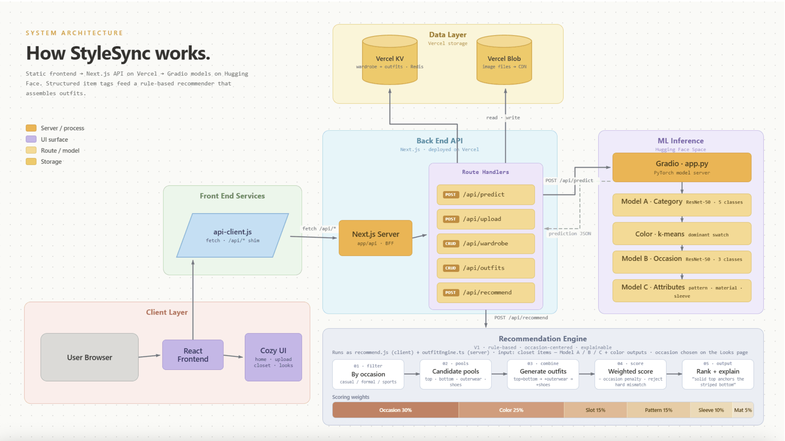

# StyleSync

A wardrobe planning tool that turns photos of individual clothing items into complete outfit suggestions. Upload a photo of any clothing piece, and StyleSync classifies it, extracts its color and attributes, and adds it to your digital closet. From there, a rule-based outfit engine assembles complete looks filtered by occasion — casual, formal, or sports.

**Live app:** [style-synced.vercel.app](https://style-synced.vercel.app/#/home)  
**ML inference:** [aaron8wong/stylesync-app](https://huggingface.co/spaces/aaron8wong/stylesync-app) (Hugging Face Spaces)  
**GitHub:** [manasamaddi1/StyleSync](https://github.com/manasamaddi1/StyleSync)

---

## Table of Contents

- [Architecture](#architecture)
- [Key Algorithms & Modeling Decisions](#key-algorithms--modeling-decisions)
- [Repository Structure](#repository-structure)
- [Models](#models)
- [Setup & Running Locally](#setup--running-locally)
- [Environment Variables](#environment-variables)
- [Deployment](#deployment)
- [Limitations & Known Issues](#limitations--known-issues)

---

## Architecture

StyleSync has three layers: a **static frontend** served by Vercel, a **Next.js API layer** that handles routing and storage, and a **Gradio inference app** on Hugging Face Spaces that runs all three PyTorch models.



**Key architectural decisions:**

**Gradio on Hugging Face Spaces for inference.** PyTorch models require more memory than Vercel serverless functions allow (ResNet-50 weights alone are ~100MB, above Vercel's 50MB limit). HF Spaces provides free persistent compute for Gradio apps with no size constraint.

**Static frontend + Next.js API routes as a proxy layer.** The visible UI is a static HTML/JSX app served from `public/`. The Next.js `app/api/` layer proxies image uploads to the HF Space and handles wardrobe and outfit CRUD via Vercel KV.

**Vercel KV for wardrobe persistence.** Wardrobe and outfit data is stored in Vercel KV (Redis), natively integrated with Vercel deployments, giving the app persistent state across sessions without a separate database.

---

## Key Algorithms & Modeling Decisions

### Model A — Clothing Category Classifier

A **ResNet-50** pretrained on ImageNet, fine-tuned on the [Myntra Fashion Product Images Dataset](https://www.kaggle.com/datasets/paramaggarwal/fashion-product-images-dataset) to classify clothing into 5 categories: Tops, Bottomwear, Shoes, Dress, Outerwear.

**Dataset:** 23,393 images after filtering to the 5 relevant subCategories.

| subCategory | Count |
|-------------|-------|
| Tops | 12,776 |
| Shoes | 7,321 |
| Bottomwear | 2,537 |
| Dress | 480 |
| Outerwear | 279 |

**Training approach:**
- Stage 1 — frozen backbone, classification head only (warmup epochs)
- Stage 2 — unfreeze `layer4` for partial fine-tuning
- 80/20 train/validation split, batch size 32
- Class-weighted loss to handle the severe Tops vs Outerwear imbalance (~46:1)

**Final validation results:**

| Class | Precision | Recall | F1 |
|-------|-----------|--------|----|
| Tops | 0.996 | 0.968 | 0.982 |
| Bottomwear | 0.983 | 0.989 | 0.986 |
| Shoes | 0.999 | 0.999 | 0.999 |
| Dress | 0.739 | 0.940 | 0.828 |
| Outerwear | 0.542 | 0.968 | 0.695 |
| **Weighted avg** | **0.985** | **0.979** | **0.981** |

**Why no image cropping:** Myntra images are already centered on the labeled item. Rule-based cropping was tested but found to be unnecessarily aggressive — images were already 80–90% the target item, and training on full images performed better.

**Why ResNet-50:** Strong ImageNet pretraining provides transferable visual features without a large fashion-specific dataset. Fine-tuning only the final layer and `layer4` keeps compute low enough for a standard laptop.

---

### Model B — Occasion Classifier

A second fine-tuned ResNet-50 predicting which of 3 occasions a clothing item belongs to: `casual`, `formal`, `sports`.

**Why only 3 occasions:** Early experiments with 5 classes (including Ethnic and Smart Casual) produced poor recall on underrepresented classes. Collapsing to 3 well-separated and visually distinct occasions improved macro F1 and makes the recommendation engine more reliable.

**Class imbalance handling:**
- v1: Class-weighted CrossEntropyLoss
- v2 (final): Data capping — Casual capped at 2,000 rows, keeping all Sports and Formal rows

**Final validation results (v2):**

| Occasion | Precision | Recall | F1 |
|----------|-----------|--------|----|
| Casual | 0.842 | 0.838 | 0.840 |
| Sports | 0.930 | 0.928 | 0.929 |
| Formal | 0.947 | 0.955 | 0.951 |

---

### Model C — Attribute Predictor (Multi-Head CNN)

A shared **ResNet-50 backbone with three prediction heads**, trained on the [DeepFashion](http://mmlab.ie.cuhk.edu.hk/projects/DeepFashion.html) Fine-Grained Attribute dataset.

| Head | Classes | Applies To |
|------|---------|------------|
| `pattern_family` | solid, graphic, striped, other | Tops, Bottomwear, Outerwear |
| `material_family` | denim, leather, other | Tops, Bottomwear, Outerwear |
| `sleeve_family` | sleeveless, short_sleeve, long_sleeve | Tops, Outerwear |

**Why one shared backbone:** A single ResNet-50 with three heads shares visual feature extraction across all attribute tasks, requires one-third the training compute of separate models, and uses masked supervision so each category only trains the heads relevant to it. Bottomwear never contributes gradient signal to the `sleeve_family` head.

**Two-stage training:**
- Stage 1 — frozen backbone, head warmup
- Stage 2 — unfreeze `layer3` and `layer4` with lower learning rate (`5e-5`)

**Final validation results (V3):**

| Head | Accuracy | Majority Baseline | Macro F1 |
|------|----------|-------------------|----------|
| `pattern_family` | 0.796 | 0.534 | 0.718 |
| `material_family` | 0.742 | 0.662 | 0.632 |
| `sleeve_family` | 0.927 | 0.507 | 0.919 |

`material_family` is the weakest head — only 8 points above the majority baseline. It is assigned the lowest weight (5%) in the outfit scoring engine.

---

### Color Extraction

Dominant color extracted using **k-means clustering** (k=3) on pixels resized to 100×100. Near-white pixels are masked to prevent white product backgrounds dominating. The dominant cluster centroid is mapped to the closest named color via Euclidean distance in RGB space across a 13-color palette: black, white, cream, gray, brown, tan, red, orange, yellow, green, blue, pink, purple.

---

### Outfit Recommendation Engine

A deterministic **rule-based scoring engine** implemented in `stylesync-vercel/lib/outfitEngine.ts`. There is no outfit-level training dataset with true compatibility labels, so rule-based scoring is more reliable and explainable at this stage.

**Pipeline:**
1. Filter wardrobe by target occasion, with a closest-score fallback for sparse closets
2. Build candidate pools (tops, bottoms, shoes, outerwear, dresses)
3. Generate all valid outfit combinations (top+bottom, dress, with/without shoes and outerwear)
4. Score each combination using weighted signals
5. Apply occasion penalty layer — mismatched items are penalized; hard mismatches are rejected
6. Rank by score, deduplicate, return top 3 with natural-language explanations

**Scoring weights:**

| Signal | Weight |
|--------|--------|
| Occasion consistency | 30% |
| Color compatibility | 25% |
| Slot completeness | 15% |
| Pattern compatibility | 15% |
| Sleeve / layering | 10% |
| Material compatibility | 5% |

**Color rules:** Neutrals (black, white, cream, gray, brown, tan) always pair safely. One accent with neutrals scores 0.9. Mixed warm+cool accents without a neutral anchor score 0.5. Multiple unrelated accents score 0.2.

**Pattern rules:** At least one solid or striped anchor is rewarded. One loud pattern (graphic, floral) with a solid scores 0.9. Two loud patterns together score 0.2.

Every outfit suggestion returns 1–3 plain-English explanations — e.g. "The solid top anchors the graphic bottom" or "The color palette stays in the same neutral family."

The Remix feature uses the same engine — selecting a focus item and fetching scored outfit suggestions via `POST /api/outfits`.

---

## Repository Structure

```
StyleSync/
├── app.py                          ← Gradio inference app (deployed to HF Spaces)
│                                     Runs Models A, B, C + color extraction
├── requirements.txt                ← Python dependencies for app.py
│
├── models/
│   ├── resnet50_stylesync.pt               ← Model A v1 (live)
│   ├── resnet50_stylesync_improved.pt      ← Model A v2 (pending deployment)
│   └── resnet50_stylesync_occasion_v2.pt   ← Model B weights
│
├── DeepFashion/
│   ├── attribute_modeling/
│   │   └── model_b_v1/
│   │       ├── model_b_v1_training.ipynb
│   │       ├── model_b_v2_training.ipynb
│   │       ├── MODEL_B_V1_MODELING.md      ← Model C design spec
│   │       └── outputs/
│   │           ├── model_b_v3_material_merged_resnet50_best.pt  ← Model C weights
│   │           └── model_b_v3_material_merged_label_vocabs.json
│   ├── data/
│   │   ├── anno_fine_v2_common_items_material_merged.csv
│   │   └── img/                            ← DeepFashion images (local only)
│   └── occasion_scoring/                   ← Scripts for occasion label derivation
│
├── data/
│   ├── combined_df.csv             ← 23,393 rows, 5 subCategories
│   ├── balanced_df.csv
│   ├── images.csv
│   └── styles.csv
│
├── notebooks/
│   ├── data_exploration.ipynb
│   ├── image_preprocessing.ipynb
│   ├── classifier_training_baseline.ipynb
│   ├── baseline_improved.ipynb
│   ├── model_training.ipynb
│   ├── model_eval_full_dataset.ipynb       ← Final Model A metrics
│   ├── occasion_classifier_training.ipynb  ← Model B v1
│   ├── occasion_classifier_v2.ipynb        ← Model B v2 (final)
│   └── occasion_distribution_analysis.ipynb
│
├── scripts/
│   ├── crop_clothing.py            ← Center-zoom utility (tested, not used in pipeline)
│   └── download_balanced_images.py
│
├── recommendation/
│   └── RECOMMENDATION_LOGIC_V1.md  ← Full outfit engine design spec
│
├── StyleSync-Frontend/             ← Static UI source files
│   ├── index.html
│   ├── app.jsx
│   └── screens-*.jsx               ← home, upload, wardrobe, outfits, remix
│
└── stylesync-vercel/               ← Next.js app (deployed product)
    ├── app/api/
    │   ├── predict/route.ts        ← POST → HF Space
    │   ├── upload/route.ts         ← POST → Vercel Blob
    │   ├── wardrobe/route.ts       ← GET / POST → Vercel KV
    │   ├── wardrobe/[id]/          ← DELETE / PATCH → Vercel KV
    │   ├── outfits/route.ts        ← GET / POST → runs outfitEngine
    │   └── outfits/[id]/           ← DELETE → Vercel KV
    ├── lib/
    │   ├── hf-client.ts            ← HF Space client via @gradio/client
    │   ├── kv-store.ts             ← Vercel KV CRUD
    │   ├── outfitEngine.ts         ← Rule-based outfit scoring engine
    │   └── types.ts                ← Shared TypeScript types
    └── public/                     ← Static frontend
        ├── index.html
        ├── api-client.js           ← JS shim → Next.js API routes
        └── screens-*.jsx
```

---

## Models

All models use ResNet-50 pretrained on ImageNet as the backbone.

| Model | File | Task |
|-------|------|------|
| Model A | `models/resnet50_stylesync_improved.pt` | Clothing category (5 classes) | 
| Model B | `models/resnet50_stylesync_occasion_v2.pt` | Occasion (3 classes) | 
| Model C | `DeepFashion/.../model_b_v3_material_merged_resnet50_best.pt` | Pattern, material, sleeve | 

**Model weights are not committed to GitHub** due to file size. Contact a team member for the `.pt` files, or download them from the HF Space Files tab.

---

## Setup & Running Locally

### Prerequisites

- Python 3.10+
- Node.js 18+

### 1. Clone the repo

```bash
git clone https://github.com/manasamaddi1/StyleSync.git
cd StyleSync
```

### 2. Run the Gradio inference app locally

```bash
# python dependencies
pip install -r requirements.txt

python app.py
```

Gradio runs at **http://localhost:7860**. Requires `resnet50_stylesync.pt` and the occasion and attribute model weights to be present in the expected paths before starting.

### 3. Run the Next.js frontend locally

```bash
cd stylesync-vercel
npm install
npm run dev
```

Frontend runs at **http://localhost:3000**. Requires `.env.local` to be configured — see [Environment Variables](#environment-variables).

### 4. Full local stack

Run both simultaneously in separate terminal tabs:

- Terminal 1: `python app.py` (Gradio on port 7860)
- Terminal 2: `cd stylesync-vercel && npm run dev` (Next.js on port 3000)

The Vercel KV credentials in `.env.local` are required for wardrobe and outfit features to work locally. Get these from a teammate via the Vercel dashboard under **Storage → your KV database → `.env.local` tab**.

---

## Environment Variables

### `stylesync-vercel/.env.local`

| Variable | Description |
|----------|-------------|
| `HF_SPACE_ID` | HF Space ID for inference (default: `aaron8wong/stylesync-app`) |
| `KV_URL` | Vercel KV connection URL — auto-injected by Vercel when KV is provisioned |
| `KV_REST_API_URL` | Vercel KV REST URL — auto-injected by Vercel |
| `KV_REST_API_TOKEN` | Vercel KV token — auto-injected by Vercel |
| `KV_REST_API_READ_ONLY_TOKEN` | Vercel KV read-only token — auto-injected by Vercel |

The four `KV_*` variables are automatically set by Vercel in production. For local development, copy them from the Vercel dashboard.

---

## Deployment

### Frontend — Vercel

Deploys automatically on every push to `main`. To redeploy manually:

```bash
cd stylesync-vercel
npx vercel --prod
```

### ML Inference — Hugging Face Spaces

The Gradio app is deployed at [aaron8wong/stylesync-app](https://huggingface.co/spaces/aaron8wong/stylesync-app).

To update:
1. Push updated `app.py` and `requirements.txt` to the HF Space repo
2. Upload updated `.pt` model weights via the HF Space Files tab
3. The Space restarts automatically

---

## Limitations & Known Issues

| Area | Limitation |
|------|------------|
| **Outerwear precision** | Model A precision for Outerwear is 0.542 due to only 279 training samples. The model over-predicts Outerwear for ambiguous items like cardigans and heavy knits. |
| **Material head reliability** | Model C `material_family` scores only 8 points above the majority baseline. Assigned the lowest weight (5%) in outfit scoring — treat material predictions as low-confidence. |
| **Color on white backgrounds** | The k-means extractor masks near-white pixels but may still pick up off-white or cream backgrounds on light garments as the dominant color. |
| **No user authentication** | Wardrobe is session-scoped with no login. Multiple users sharing a session share the same wardrobe. |
| **HF Space cold start** | First prediction after the Space has been idle takes several seconds to load models into memory. |
| **Model weights not in repo** | `.pt` files exceed GitHub's 100MB limit and are excluded. The Gradio app will fail to start without them. |
| **Outfit engine cannot model silhouette or fit** | The V1 engine is strongest on color harmony, occasion consistency, and pattern compatibility. It cannot reason about item length, body proportion, or personal style preference. |
